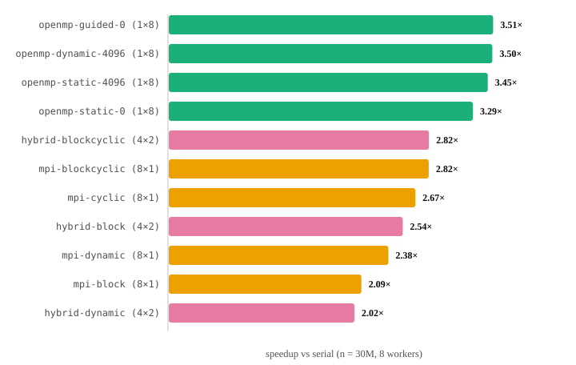
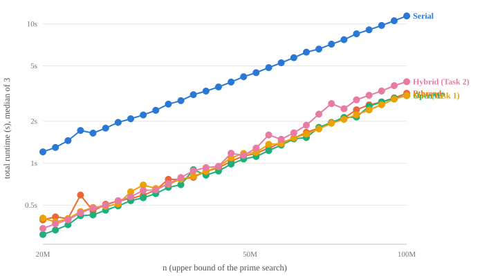
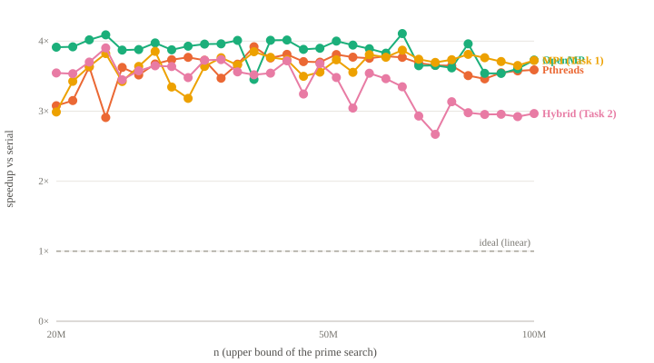
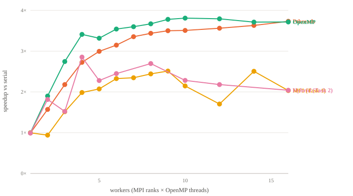
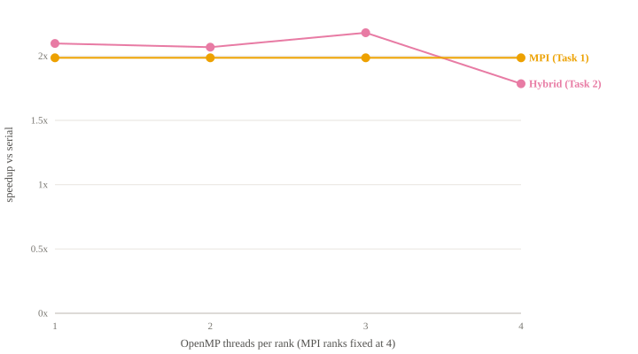
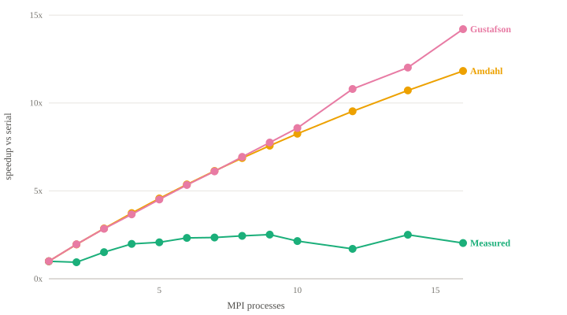
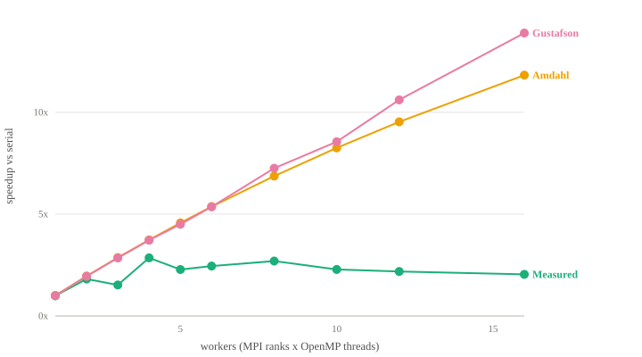

# Prime Search with the Message Passing Interface

**FIT3143 Parallel Computing — Lab #2 Report (Task 4)**

⟨Name 1⟩, ⟨Student ID⟩, ⟨email⟩@student.monash.edu
⟨Name 2⟩, ⟨Student ID⟩, ⟨email⟩@student.monash.edu

---

## Contents

1. [Introduction](#1-introduction)
2. [Experimental setup and measurement design](#2-experimental-setup-and-measurement-design)
3. [Task 1 — Prime search with Open MPI](#3-task-1--prime-search-with-open-mpi)
4. [Task 2 — Hybrid Open MPI + OpenMP](#4-task-2--hybrid-open-mpi--openmp)
5. [Task 3 — Performance evaluation with Amdahl's and Gustafson's Laws](#5-task-3--performance-evaluation-with-amdahls-and-gustafsons-laws)
6. [Discussion](#6-discussion)
7. [Conclusions](#7-conclusions)
8. [Appendices](#8-appendices)

---

## 1. Introduction

This report documents a distributed implementation of the prime search problem
introduced in Week 4 (Lab #1) and extends it in two directions: a pure
message-passing version using Open MPI (Task 1), and a hybrid version combining
message passing across processes with shared-memory threading inside each
process (Task 2). It then evaluates both empirically and against the
theoretical bounds given by Amdahl's and Gustafson's Laws (Task 3).

The problem is to find every prime strictly less than an integer *n* supplied
on the command line, and to write the complete result to a text file in
ascending order. The root process reads *n*, disseminates it to every other
process with `MPI_Bcast`, each process computes a share of the candidate range,
and the root gathers, orders and writes the result.

**The single most important property of this study is that the trial-division
kernel is byte-identical across all five implementations** — the Week 4 serial,
POSIX threads and OpenMP versions, and the two implementations documented here.
Speedup is defined as T_serial / T_parallel, so holding the per-candidate work
constant is what makes the comparison measure parallelism rather than a change
of algorithm. No sieve is used anywhere; a faster algorithm would produce better
runtimes and a *worse* experiment.

---

## 2. Experimental setup and measurement design

### 2.1 Platform

| Property | Value |
|---|---|
| Cores | 10 physical — 4 performance + 6 efficiency (Apple silicon) |
| Environment | Docker container, Open MPI 5.x, GCC with `-O2 -fopenmp` |
| Problem sizes | 30 distinct values of *n*, from 20,000,000 to 100,000,000 |
| Repetitions | 3 per configuration |
| Reduction | **Median** across repetitions |
| Baseline | Week 4 Task 1 serial program, at the same *n* |

The heterogeneous core layout matters and is referred to repeatedly below: four
fast cores and six slow ones mean that handing every worker an equal quantity of
work produces an unequal *finishing time* by construction, independent of how
carefully the candidate range is divided.

Worker counts beyond 10 were measured deliberately, in order to characterise
what oversubscription costs rather than to find a faster configuration.

### 2.2 Why the median, and why `MPI_MAX`

Two measurement decisions shape every number in this report.

**Repetitions are reduced by median, not mean.** These runs share the host with
the operating system. A single scheduling interruption displaces the mean of
three samples substantially while leaving the median untouched.

**`t_compute` is reduced across ranks with `MPI_MAX`, not averaged.** The
wall-clock cost of a parallel phase is determined by when its *slowest* rank
finishes, not by the average rank. Averaging would conceal load imbalance —
which is precisely the quantity the partitioning experiments in §3.2 exist to
measure. `MPI_MIN` is reduced alongside it and the ratio between them recorded
as an explicit `imbalance` column.

### 2.3 Phase-resolved timing

Both parallel programs are instrumented so that the phases partition the whole
run. This is what makes the theoretical analysis in §5 possible: the serial and
parallel fractions are *measured*, not assumed.

| Phase | Meaning | Classification |
|---|---|---|
| `t_alloc` | buffer allocation | serial |
| `t_bcast` | `MPI_Bcast` of *n* to every rank | serial |
| `t_compute` | the distributed prime search | **parallel** |
| `t_lsort` | each rank ordering its own results (Task 2) | **parallel** |
| `t_comm` | `MPI_Gather` + `MPI_Gatherv` of results | serial |
| `t_sort` | root ordering the gathered result | serial |
| `t_io` | root writing the output file | serial |
| `t_total` | `MPI_Init` to just before `MPI_Finalize` | — |

Two classifications deserve justification. `t_lsort` is counted as **parallel**
work because every rank executes it simultaneously on disjoint data; charging it
as serial would inflate the serial fraction for the hybrid alone and make the
two implementations incomparable. A barrier precedes the compute timer so that
`t_compute` measures the phase itself rather than accumulated rank skew.

The serial baseline is instrumented with the corresponding smaller set —
`t_alloc`, `t_compute`, `t_merge`, `t_io` — since it has nothing to broadcast
and nothing to gather. Section 5.2 depends on this.

---

## 3. Task 1 — Prime search with Open MPI

### 3.1 Partitioning schemes

Trial division tests divisors up to √k, so **the cost of a candidate grows with
its value.** A scheme that hands each rank an equal-sized contiguous range
therefore hands the high-numbered ranks more work than the low-numbered ones.
Load balance is consequently not a matter of dividing the range evenly — it is a
matter of dividing the *cost* evenly, and those are different problems.

Four schemes were implemented so that the trade-off could be measured rather
than asserted. All are selectable at runtime via `--scheme`.

| Scheme | Allocation | Balance | Sort at root |
|---|---|---|---|
| `block` | rank *r* takes one contiguous range | poor — high ranks do more | **not needed** |
| `cyclic` | rank *r* takes k = 2+r, 2+r+P, 2+r+2P, … | very good | required |
| `blockcyclic` | chunks of `--chunk` candidates dealt round-robin | very good | required |
| `dynamic` | master–worker; rank 0 issues chunks on request | best in principle | required |

`block` is the only scheme requiring no global sort: each rank owns one
contiguous ascending range, so the gathered results concatenate in order.
Interleaving schemes scatter each rank's primes across [2, *n*), so the root must
sort after gathering.

**Sorting is timed separately and charged only to the schemes that actually
perform it.** Charging `block` for a sort it never runs would misrepresent its
true total cost and make the comparison meaningless.

`dynamic` is the only scheme that adapts to cores of *differing speed*, which is
directly relevant on this host: with four performance and six efficiency cores,
equal work on unequal cores is imbalanced no matter how the range is cut.

### 3.2 Which scheme performs best

Measured at *n* = 30,000,000 with 8 workers, so that the partitioning scheme is
the only variable:



| Scheme | Speedup vs serial | Relative to `block` |
|---|---|---|
| **`blockcyclic`** | **2.82×** | **+35%** |
| `cyclic` | 2.67× | +28% |
| `dynamic` | 2.38× | +14% |
| `block` | 2.09× | — |

`blockcyclic` is the best scheme, and it beats `block` by 35% on identical
hardware running identical arithmetic. This is the cheapest performance
available anywhere in the study — it costs no hardware and no algorithmic
change, only a different indexing rule.

The ordering repays attention. `block` loses to the cost gradient described in
§3.1. `cyclic` spreads that gradient almost perfectly but sacrifices cache
locality, since consecutive candidates assigned to one rank are P apart in
memory. `blockcyclic` recovers that locality — a rank walks contiguous memory
within each chunk — while retaining most of cyclic's balance, which is why it
finishes ahead of both.

`dynamic` is the interesting failure. It balances best in principle and is the
only scheme that adapts to heterogeneous cores, yet it places third. The
master–worker request traffic, at this granularity, costs more than the
imbalance it removes, and it also sacrifices one rank to coordination. This is
the first of several results in this report where measured overhead defeats a
theoretically superior design.

### 3.3 Runtime against problem size *(required graph a-1)*



Log–log axes, 30 values of *n* from 20M to 100M, all parallel implementations at
8 workers. Straight lines on log–log axes indicate that runtime follows a clean
power law in *n*, as expected for trial division. The parallel lines sit below
serial by a near-constant vertical offset, which is what a roughly constant
speedup looks like in log space.

At *n* = 100,000,000:

| Implementation | Runtime | |
|---|---|---|
| Serial (Week 4 Task 1) | 11.417 s | baseline |
| OpenMP | 3.061 s | fastest |
| **MPI (Task 1)** | **3.066 s** | level with OpenMP |
| POSIX threads | 3.180 s | |
| Hybrid (Task 2) | 3.850 s | slowest parallel |

### 3.4 Empirical speedup against problem size *(required graph a-2)*



| At *n* = 100M | OpenMP | **MPI (Task 1)** | pthreads | Hybrid |
|---|---|---|---|---|
| Speedup | 3.73× | **3.72×** | 3.59× | 2.97× |

Speedup **improves as *n* grows** for every implementation. The fixed costs —
broadcast, gather, file I/O — are amortised over an increasing quantity of
compute, so their proportional weight falls. This is the empirical counterpart
of the falling serial fraction demonstrated in §5.2.

The result of note is that MPI draws level with OpenMP at the top of the range
despite paying for inter-process communication that OpenMP does not incur at
all. MPI's overhead is roughly fixed per run, so a sufficiently large problem
conceals it.

### 3.5 Empirical speedup against process count *(required graph a-3)*

Measured at *n* = 30M, comparing MPI processes against equal thread counts for
the shared-memory implementations.



| Workers | 1 | 2 | 4 | 8 | 9 | 10 | 16 |
|---|---|---|---|---|---|---|---|
| **MPI** | 1.00× | **0.94×** | 1.99× | 2.44× | **2.51×** | 2.15× | 2.03× |
| OpenMP | 1.00× | 1.90× | 3.41× | 3.67× | 3.78× | 3.81× | 3.72× |

Two features stand out.

**MPI at two processes is slower than the serial program** (0.94×). This is the
single most revealing measurement in Task 1. With two ranks, the cost of
gathering half of the primes across a process boundary exceeds the saving from
halving the search. Parallelism is not free, and below a threshold problem-size
to communication ratio it is actively negative.

**MPI peaks at 9 processes (2.51×) and then declines** — 2.15× at 10 workers and
2.03× at 16. Past the physical core count there is no additional compute
capacity to exploit, so further ranks contribute only gather traffic, memory
pressure and context switching. OpenMP by contrast plateaus near 3.8× and stays
approximately flat, because adding threads beyond the core count costs far less
than adding processes.

---

## 4. Task 2 — Hybrid Open MPI + OpenMP

### 4.1 Two-level work decomposition

The hybrid exposes two levels of parallelism: distributed memory across MPI
ranks, which do not share an address space and must exchange results through
messages, and shared memory within each rank, where OpenMP threads cooperate
over that rank's candidates without any copying.

The design decision that keeps the two levels from interfering is that **a chunk
is the unit of work at both levels**:

```
MPI level      decides which chunks a rank owns    (--scheme: block | blockcyclic | dynamic)
OpenMP level   distributes that rank's chunks       #pragma omp for schedule(dynamic)
               across its threads
```

The pure `cyclic` scheme from Task 1 is deliberately absent from the hybrid: it
strides per candidate rather than per chunk, so it offers no natural chunk
decomposition for the OpenMP level to distribute. Under `dynamic`, rank 0 hands
out *batches* of chunks — one batch being `threads × chunk` candidates — so that
each worker rank always receives enough work to occupy all of its threads.

**Result ordering.** Threads within a rank pull chunks dynamically, so their
private buffers hold scattered values and each rank must sort its own results
before gathering. That local sort runs concurrently on every rank and is
therefore classified as parallel work (§2.3). After the gather, a global sort at
the root is required only when the MPI-level scheme interleaves chunks between
ranks; under `block` the ranks' already-sorted runs concatenate in ascending
order and the root sorts nothing.

**A measurement artifact worth documenting.** Initial hybrid results showed it as
by far the slowest implementation. The cause was Open MPI's default core
binding, which pins each rank to a single core — leaving the OpenMP threads
inside that rank with nowhere to run. Every hybrid measurement therefore uses
`--bind-to none`, and all results collected before this was identified were
discarded and the sweep re-run.

### 4.2 Threads per rank at a fixed process count *(required graph b-1)*

With MPI ranks fixed at 4 and OpenMP threads varied inside them. Task 1 has no
threads, so it appears as a flat reference at its 4-process speedup of 1.99×.



| Threads per rank | 1 | 2 | 3 | 4 |
|---|---|---|---|---|
| Total workers | 4 | 8 | 12 | 16 |
| Hybrid speedup | 2.10× | 2.07× | 2.18× | **1.78×** |

**Adding threads inside four ranks buys essentially nothing, and then hurts.**
The four ranks already occupy four cores; threads added inside them subdivide
the same silicon rather than recruiting more of it. At 4 ranks × 4 threads the
configuration requests 16 workers from a 10-core host, and oversubscription
costs 15% against the single-threaded baseline.

The best hybrid configuration sits at the opposite extreme — **1 rank × 4
threads, at 2.85×** — which is to say the configuration that is barely
distributed at all. That is an argument for OpenMP rather than for the hybrid.

### 4.3 Hybrid against shared-memory at matched worker counts *(required graph b-2)*

Comparing the hybrid against the shared-memory implementations with the total
worker count matched: a hybrid configuration of P ranks × T threads is compared
against OpenMP and pthreads running P × T threads.


| Total workers | 2 | 4 | 8 | 16 |
|---|---|---|---|---|
| OpenMP | 1.90× | 3.41× | 3.67× | 3.72× |
| pthreads | — | — | 3.67×¹ | 3.72×¹ |
| **Hybrid** | 1.81× | 2.85× | 2.70× | 2.04× |
| Best hybrid split | 1×2 | 1×4 | 1×8 | 16×1 |

¹ pthreads tracks OpenMP closely; see `fig3.svg` for the full curve.

**The hybrid never beats pure OpenMP at an equal worker count**, at any point in
the range measured. Moreover, the best hybrid split at each worker count up to 8
is the one with a single MPI rank — i.e. the split that is pure OpenMP in all
but name.

The conclusion is that on a single shared-memory host, layering MPI on top of
OpenMP adds cost and removes nothing. The hybrid's genuine case is the
multi-node one, where OpenMP cannot reach a second machine at all and MPI is the
only way to recruit it. That is the axis this hardware cannot test, and it is
the honest qualification on this result.

---

## 5. Task 3 — Performance evaluation with Amdahl's and Gustafson's Laws

### 5.1 The two laws require two different experiments

The specification warns that the two laws "have different measurement
assumptions, and you will need to design measurement experiments to compute the
serial/parallel fractions correctly." This is the crux of the task, and the two
laws cannot be fed the same measured fraction.

| | **Amdahl** | **Gustafson** |
|---|---|---|
| Held fixed | problem size *n* | execution time |
| Question | how much faster is one fixed workload? | how much more work fits in the same time? |
| Formula | S(W) = 1 / (s + p/W) | S(W) = s + p·W |
| *s* is the serial share **of what** | the **one-worker** execution | the **parallel** execution as run |
| Therefore measured on | serial `task1` at that *n* | the P×T run being scored |

**Why supplying Amdahl with a parallel run's fraction is wrong.** As workers are
added, the parallel part shrinks while the serial part does not, so the measured
serial share of a parallel run *rises* with W — in our data from 0.028 at one
worker to 0.152 at eight. Substituting that into Amdahl's formula makes the
predicted ceiling sag as W grows, and a ceiling that moves with the quantity it
is supposed to bound is not a bound at all. This is a circular measurement, and
avoiding it requires running two separate experiments.

### 5.2 Experiment A — Amdahl's fraction, from the serial program

Amdahl's *s* is a property of the workload, so it is measured on the serial
program at the same *n* — the one-worker execution whose time the law is
dividing:

```
s = median(t_alloc + t_merge + t_io) / [ that + median(t_compute) ]
p = 1 − s
```

| *n* | *s* | *p* | Ceiling S(∞) = 1/s |
|---|---|---|---|
| 20,000,000 | 0.0288 | 0.9712 | 34.8× |
| 43,497,000 | 0.0207 | 0.9793 | 48.4× |
| 100,000,000 | 0.0140 | 0.9860 | **71.7×** |

**The serial fraction falls as *n* grows, so the Amdahl ceiling rises.** Trial
division costs approximately O(n^1.5 / log n) while allocation, ordering and
file I/O scale with π(n) ≈ n / log n. The parallel part outgrows the serial part.

This is the answer to the "increasing problem size" axis of the theoretical
analysis, and it is worth stating precisely: **a larger *n* does not make the
program faster — it raises the limit on how much faster parallelism could ever
make it.** Because this fraction depends only on *n*, the Amdahl curve is
identical for the MPI and hybrid implementations, correctly so, since both
parallelise the same phase of the same algorithm.

### 5.3 Experiment B — Gustafson's fraction, from each parallel run

Gustafson's *s* is by construction the serial share of the parallel execution —
the scaled workload as actually executed — so it is measured on the run being
scored, using the phase decomposition of §2.3, at each (*n*, P, T).

Unlike Amdahl's, this fraction rises with worker count (0.028 → 0.152 from 1 to
8 workers), which under Gustafson's assumptions is expected rather than
pathological: the law asks how much more work a larger machine completes in the
same time, so the growing coordination share is part of what is being described.

### 5.4 The Karp–Flatt cross-check

Neither law charges anything for communication, so both over-predict. To
identify *which* of the two possible causes explains the shortfall, Amdahl's
formula is inverted on the **measured** speedup to recover the experimentally
determined serial fraction:

```
e = (1/S − 1/W) / (1 − 1/W)          undefined at W = 1
```

If *e* is flat in W, the gap is genuine irreducible serial work. If *e* climbs
with W, the loss is **parallel overhead** — broadcast, gather, memory bandwidth,
oversubscription — which neither law models.

| Workers | 2 | 4 | 8 | 10 | 16 |
|---|---|---|---|---|---|
| OpenMP *e* | 0.053 | 0.057 | 0.168 | 0.180 | 0.220 |
| **MPI *e*** | **1.127** | 0.338 | 0.325 | 0.407 | 0.456 |
| Hybrid *e* | 0.102 | 0.134 | 0.281 | 0.376 | 0.456 |

The true serial fraction at this *n* is 0.024. **Every measured *e* is far
larger than that, and all of them climb with W: the shortfall is overhead, not
serial code.**

The magnitudes separate the implementations cleanly. OpenMP stays below 0.22 —
threads share an address space, so there is no gather to pay for. MPI sits near
0.33–0.46, an order of magnitude above the program's actual serial fraction,
because every rank's result vector must cross a process boundary through
`MPI_Gatherv` and be merged at the root. The MPI value at two workers, *e* =
1.127, is the formal statement of the anomaly in §3.5: a value above 1 means the
configuration is slower than serial.

### 5.5 Measured against theoretical speedup *(required graphs c-1 and c-2)*

**Task 1 (Open MPI), *n* = 30M, Amdahl s = 0.0236, ceiling 42.4×:**



| Workers | 1 | 2 | 4 | 8 | 16 |
|---|---|---|---|---|---|
| **Measured** | 1.00× | 0.94× | 1.99× | 2.44× | 2.03× |
| Amdahl | 1.00× | 1.95× | 3.74× | 6.87× | 11.82× |
| Gustafson | 1.00× | 1.96× | 3.67× | 6.94× | 14.20× |

**Task 2 (hybrid MPI + OpenMP), same *n*:**



| Workers | 1 | 2 | 4 | 8 | 16 |
|---|---|---|---|---|---|
| **Measured** | 0.99× | 1.81× | 2.85× | 2.70× | 2.04× |
| Amdahl | 1.00× | 1.95× | 3.74× | 6.87× | 11.82× |
| Gustafson | 1.00× | 1.95× | 3.72× | 7.26× | 13.89× |

Three observations follow.

**The gap widens with W.** Both laws model only how work is divided; neither
assigns any cost to its re-collection. As worker count rises, the gather grows
while the predicted speedup grows too, so the curves diverge. Karp–Flatt (§5.4)
confirms the divergence is overhead rather than serial code.

**Gustafson exceeds Amdahl beyond 8 workers** (14.20× against 11.82× at W = 16).
This is not a contradiction — the two laws answer different questions.
Gustafson assumes the workload grows with the machine, and ours does not. For
this fixed-*n* experiment **Amdahl is the appropriate model**; Gustafson is
reported to show what the same code would promise under a weak-scaling regime.

**Amdahl saturates long before the ceiling.** At *n* = 30M the ceiling is 42.4×,
but 40 workers would buy only 20.8× — under half — and reaching 90% of the
ceiling would require roughly 380 workers. The theoretical limit is not
approached gently; the returns die early.

For the hybrid, both laws see only the *product* P × T and therefore predict a
single value for every split with the same worker count. The measurements do
not: at 8 workers, 1×8 gives 2.70× while 8×1 gives 2.64× and other splits differ
more widely, because threads inside a rank skip the gather entirely while ranks
pay for it. That modelling gap is precisely what figure 7 exposes.

---

## 6. Discussion

**How does the actual speedup compare against the theoretical speedup?**
It falls well below both, and the gap widens with worker count: at 8 workers MPI
achieves 2.44× against an Amdahl prediction of 6.87×, and at 16 workers 2.03×
against 11.82×. Neither law brackets the measurement usefully, because both
model the division of work and neither models its re-collection. Karp–Flatt
localises the discrepancy — *e* rises monotonically with W in all three
implementations, so the missing speedup is communication and memory-bandwidth
overhead rather than serial code.

**Will more MPI processes always increase the speedup?**
No, in either sense. Theoretically, Amdahl saturates: at *n* = 30M the ceiling
is 42.4× regardless of how many processes are added. Empirically it is worse
than saturation — the measured MPI curve peaks at 9 processes (2.51×) and then
*declines*, to 2.15× at 10 and 2.03× at 16, because past the physical core count
extra ranks add gather traffic without adding compute. And at the small end, two
processes are slower than one.

**How does the workload distribution affect the speedup?**
Substantially, and it is the one variable that costs nothing to change. At
*n* = 30M with 8 workers, `blockcyclic` (2.82×) beats `block` (2.09×) by 35% on
identical hardware running identical arithmetic. `block` loses because
trial-division cost grows with candidate magnitude, so the rank holding the
highest range gates the whole phase. `blockcyclic` interleaves small strided
chunks so that every rank draws a mixture of cheap and expensive candidates,
while chunking preserves the cache locality that pure `cyclic` sacrifices.

**Will the speed-up results be the same across different machines?**
No. The Amdahl ceiling is a property of the program and *n* and will transfer —
s = 0.024 at 30M reflects the algorithm's phase mix, not the hardware.
Everything empirical is a property of the host: core count sets where the curve
turns over, memory bandwidth per core sets how early efficiency decays, and
interconnect speed sets the gather cost that dominates our Karp–Flatt figures. A
machine with more cores would move the peak to the right; one with faster
core-to-core bandwidth would lower *e* and narrow the gap to theory with no code
change at all.

**Would you recommend Open MPI for prime searching, against POSIX threads or
OpenMP?**
Not on a single machine. MPI reaches the same peak speedup as OpenMP at large
*n* (3.72× against 3.73× at *n* = 100M) but pays far more overhead to get there,
loses badly at low process counts, and is actually slower than serial at two
processes. For a shared-memory host, OpenMP is the correct tool: simpler, no
gather, and better across the whole worker range.

Across machines the recommendation inverts, because OpenMP cannot reach a second
node at all. MPI's advantages are aggregate memory capacity and multi-node
reach; its costs, for this problem specifically, are that the result set is
large — millions of integers — and every one of them must cross a process
boundary to be gathered and sorted at the root. Prime search has an unusually
high result-volume to compute-volume ratio, which is exactly the profile that
punishes message passing.

---

## 7. Conclusions

1. **Partitioning is the cheapest available win.** `blockcyclic` over `block` is
   +35% for no hardware change and no algorithmic change.
2. **More processes is not monotonically better.** MPI peaks at 9 processes and
   declines thereafter; at 2 processes it is slower than the serial program.
3. **On a single shared-memory host, MPI's gather is the binding constraint.**
   Karp–Flatt *e* of 0.33–0.46 against a true serial fraction of 0.024 shows the
   loss is overhead, not serial work.
4. **The hybrid loses to pure OpenMP at every matched worker count measured**,
   and its best configurations are the ones with fewest ranks. Its genuine case
   is multi-node, the axis this hardware cannot test.
5. **Neither law is useful here without an overhead term.** Amdahl and Gustafson
   both model how work is divided; neither models how it is re-collected, which
   is where this program actually spends its lost speedup.

---

## 8. Appendices

### Appendix A — AI declaration

⟨Required. Declare Generative-AI use during the preparation period and attach
the prompt records as PDF, or state that none was used. AI tools were not used
during the presentation, oral or coding interview sessions.⟩

### Appendix B — Reproducing the results

```sh
bench/sweep.sh          # serial, pthreads, OpenMP baselines
bench/sweep-mpi.sh      # Task 1
bench/sweep-hybrid.sh   # Task 2

python3 bench/analyse.py --out bench/analysis   # both laws + Karp-Flatt
python3 bench/report.py  --out bench/analysis   # figures 1-8 + report.html
```

Individual sweeps can be re-measured in isolation via the `SWEEPS` and
`MAIN_SCHEME` environment variables. Raw per-repetition CSVs are retained in
`bench/results/`; `bench/analysis/summary.csv` holds the reduced medians and
every derived quantity used in this report.

### Appendix C — Figure index

| Figure | Shows | Specification requirement |
|---|---|---|
| `fig1.svg` | runtime against *n* | (a) 1 |
| `fig2.svg` | empirical speedup against *n* | (a) 2 |
| `fig3.svg` | speedup against worker count | (a) 3, (b) 2 |
| `fig4.svg` | parallel efficiency | supporting |
| `fig5.svg` | partitioning scheme comparison | supporting |
| `fig6.svg` | Task 1 measured vs theoretical | (c) 1 |
| `fig7.svg` | Task 2 measured vs theoretical | (c) 2 |
| `fig8.svg` | threads per rank at fixed process count | (b) 1 |

All figures are in `bench/analysis/figures/` as standalone SVG.

### Appendix D — Source files

| File | Contents |
|---|---|
| `lab-2/task1.c` | Task 1 — Open MPI, four partitioning schemes |
| `lab-2/task2.c` | Task 2 — hybrid MPI + OpenMP, two-level decomposition |
| `lab-2/task3-performance-evaluation.md` | Task 3 — full derivations and experimental design |
| `week-4-lab-1/task1.c` | serial baseline (speedup denominator) |
| `week-4-lab-1/task2.c` | POSIX threads baseline |
| `week-4-lab-1/task3.c` | OpenMP baseline |
