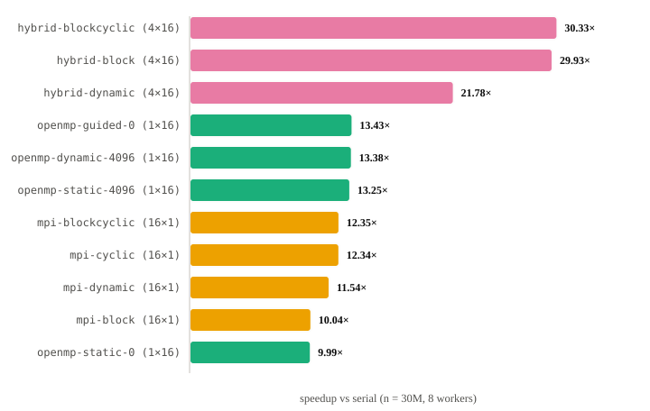
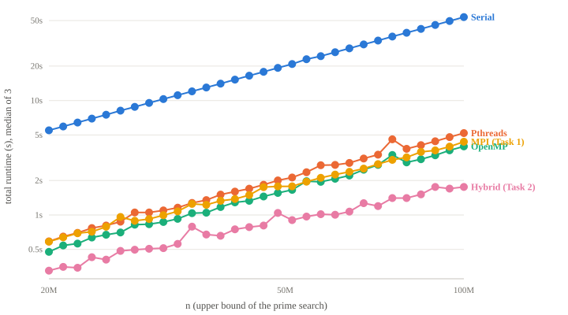
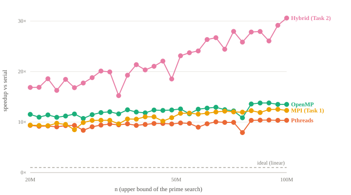
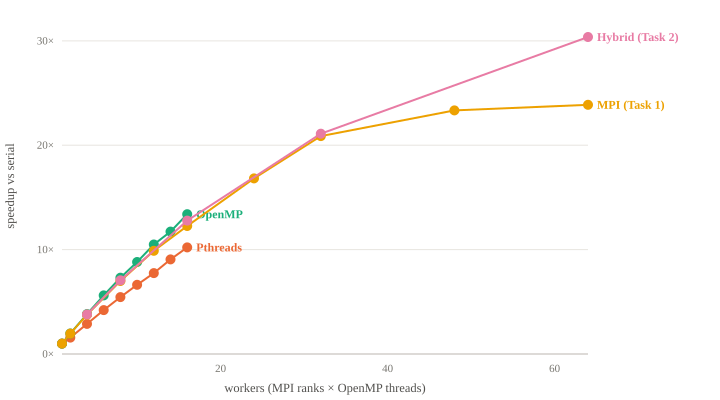
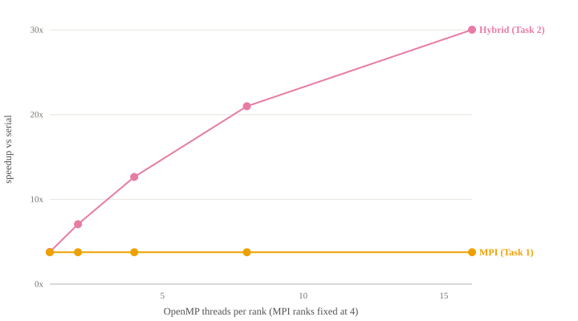
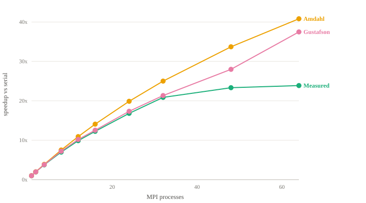
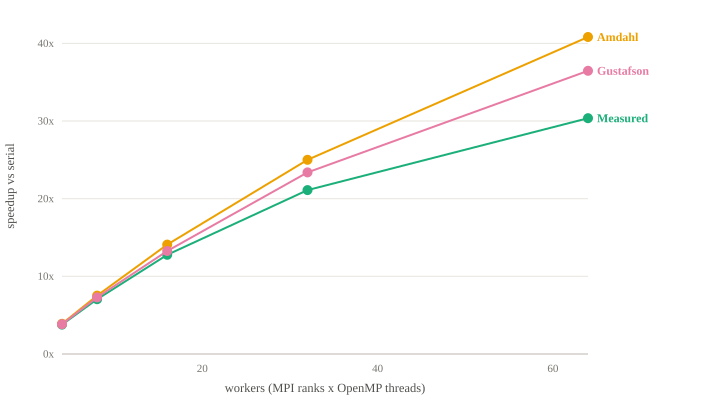

# Prime Search with the Message Passing Interface

**FIT3143 Parallel Computing — Lab #2 Report (Task 4)**

Timothy Tan Zhi-Jing, 34478000, ttan0101@student.monash.edu
Wong Ka Jen, 33214263, kwon0124@student.monash.edu

---

## Contents

1. [Introduction](#1-introduction)
2. [Experimental setup](#2-experimental-setup)
3. [Task 1 — Prime search with Open MPI](#3-task-1--prime-search-with-open-mpi)
4. [Task 2 — Hybrid Open MPI + OpenMP](#4-task-2--hybrid-open-mpi--openmp)
5. [Task 3 — Amdahl's and Gustafson's Laws](#5-task-3--amdahls-and-gustafsons-laws)
6. [Discussion](#6-discussion)
7. [Conclusions](#7-conclusions)
8. [Appendices](#8-appendices)

---

## 1. Introduction

In Week 4 we wrote a prime search three ways: serial, with POSIX threads, and
with OpenMP. This report adds two more versions and evaluates them:

- **Task 1** spreads the work across separate processes that talk to each
  other with Open MPI.
- **Task 2** is a *hybrid*: MPI processes, each of which also runs a team of
  OpenMP threads.
- **Task 3** compares the measured speedups against what Amdahl's Law and
  Gustafson's Law predict.

The problem itself is unchanged:

- The program is given a number *n* on the command line.
- It must write every prime smaller than *n* to a text file, in ascending
  order.
- In the MPI versions, the root process (rank 0) broadcasts *n* to everyone;
  every process — including the root — searches part of the range; the root
  collects all the results, sorts them, and writes the file.

**All five programs use exactly the same prime test.**

- Speedup is defined as T_serial / T_parallel.
- If the parallel versions used a faster algorithm, the comparison would
  measure the algorithm change, not the parallelism.
- So the work per number is held constant, and no sieve is used.

All results in this report come from the Monash CAAS cluster. An earlier run on
a single laptop is mentioned twice, clearly labelled, only for what it shows
qualitatively.

---

## 2. Experimental setup

### 2.1 Platform

| Property | Value |
|---|---|
| Cluster | Monash CAAS, partition `defq` |
| Nodes | 4 × AMD EPYC 7763, 16 cores each — **64 cores total** |
| Interconnect | Gigabit ethernet |
| Toolchain | Open MPI 4.1.5, GCC 11.2, `-O2 -fopenmp`, launched with `srun` |
| Problem sizes | 30 distinct *n*, 20,000,000 → 100,000,000, geometric spacing |
| Repetitions | 3 per configuration, reduced by **median** |
| Baseline | Week 4 serial program, re-measured on the same nodes, at the same *n* |

- The serial program takes 5.49 s at *n* = 20M and 53.72 s at *n* = 100M.
- One node has 16 cores, so any run with more than 16 workers spans several
  nodes and has to send data over the network.
- We never ran more workers than cores: the largest configuration uses all 64.

**Partitioning scheme.**

- Every headline number uses the `blockcyclic` scheme (work dealt out in
  4096-number chunks, round-robin). It is the default in both programs.
- The alternative `dynamic` scheme, where rank 0 hands out work on request,
  only appears in the scheme comparison (§3.3).
- `dynamic` is not used anywhere else because it turns rank 0 into a pure
  dispatcher that does no searching, and the specification requires every
  process — root included — to do a share of the work.

**Choice of *n* for headline numbers.**

- The specification warns against quoting runs that finish in under a second,
  because timing noise dominates.
- 43 of our 207 configurations do finish under 1 s — all of them
  high-worker-count runs at *n* ≤ 54M.
- At those sizes the hybrid's speedup jumps around by up to 14% between
  neighbouring points.
- **All headline numbers are therefore taken at *n* = 100M**, where even the
  fastest configuration takes 1.76 s.
- The smaller *n* values are still plotted, but only to show the trend.

### 2.2 What is timed

Both parallel programs record the time spent in each phase of the run. The
phases add up to the whole run, which means the serial and parallel fractions
used in §5 are *measured*, not guessed:

| Phase | Meaning | Class |
|---|---|---|
| `t_alloc` | allocating buffers | serial |
| `t_bcast` | `MPI_Bcast` of *n* | serial |
| `t_compute` | the distributed prime search | **parallel** |
| `t_lsort` | each rank sorting its own results (Task 2 only) | **parallel** |
| `t_comm` | `MPI_Gather` + `MPI_Gatherv` to collect the results | serial |
| `t_sort` | root sorting the collected results | serial |
| `t_io` | root writing the file | serial |
| `t_total` | from `MPI_Init` to just before `MPI_Finalize` | — |

Three decisions affect every number that follows:

- **We report the median of 3 runs, not the mean.**
  - CAAS nodes can be shared with other jobs.
  - If one of the three runs is slowed down by someone else's work, the mean
    moves but the median does not.
- **`t_compute` is the time of the *slowest* rank.**
  - A phase is not finished until every rank has finished, so we reduce
    `t_compute` with `MPI_MAX`.
  - We also record the fastest rank (`MPI_MIN`) and report the ratio
    MAX / MIN as the **imbalance**.
  - Imbalance 1.0 means every rank finished together; 4.0 means the slowest
    rank took four times as long as the fastest.
- **`t_lsort` counts as parallel time.**
  - Every rank sorts its own results at the same time, on different data.
  - Counting it as serial would unfairly penalise the hybrid, which is the
    only program that does it.

The serial baseline records the phases that apply to it (`t_alloc`,
`t_compute`, `t_merge`, `t_io`).

---

## 3. Task 1 — Prime search with Open MPI

### 3.1 Implementation and optimisations

The flow of the program:

1. Rank 0 reads *n* from the command line and broadcasts it with `MPI_Bcast`.
2. Every rank, including rank 0, searches its share of the range.
3. Each rank sends its count of primes in one `MPI_Gather`, then its actual
   primes in one `MPI_Gatherv`.
4. Rank 0 sorts the combined list if needed and writes the file.

The optimisations, from most to least important:

- **The prime test.**
  - `is_prime` rejects even numbers with a single modulo, then tries only odd
    divisors up to ⌊√k⌋ — half the divisions of a naive loop.
  - This function is identical, byte for byte, in all five programs.
- **No wasted candidates.**
  - The `cyclic` scheme only ever visits odd numbers: rank *r* starts at
    3 + 2r and steps by 2P.
  - No rank is handed a run of even numbers that the test would reject one at
    a time.
- **Memory sized to the answer, not the input.**
  - Instead of `malloc(n)`, each rank's buffer is sized from a known upper
    bound on the number of primes, π(x) < 1.26 x / ln x, divided by the number
    of ranks P.
  - At *n* = 100M with 16 ranks that is about 3.4 MB per rank instead of
    800 MB.
  - The buffer grows if the bound is ever exceeded (it never is).
- **One collective call instead of P messages.**
  - Counts are gathered first, so the root knows exactly where each rank's
    primes go in the combined buffer.
  - Then all the primes move in a single `Gatherv`.
- **Skip the sort when it is not needed.**
  - Under the `block` scheme each rank owns a contiguous range in ascending
    order.
  - The combined list is therefore already sorted, and the root skips `qsort`.
- **Honest timing.**
  - A barrier runs before the compute timer starts.
  - `t_compute` is reduced with `MPI_MAX` and `MPI_MIN`.
  - `t_total` runs from `MPI_Init` to `MPI_Finalize`, so the reported speedup
    includes the broadcast, the gather, the sort and the file write, as the
    specification requires.

### 3.2 Partitioning schemes

Why the choice of scheme matters:

- Testing a number *k* for primality costs up to √k divisions, so **bigger
  numbers cost more to test**.
- If you give each rank an equal *slice of the range*, the rank with the
  biggest numbers does the most work.

Four ways of dividing the work were implemented, chosen with `--scheme`:

| Scheme | How work is assigned | Balance | Sort at root |
|---|---|---|---|
| `block` | rank *r* takes one contiguous slice of the range | poor — high ranks do more | not needed |
| `cyclic` | rank *r* takes k = 2+r, 2+r+P, 2+r+2P, … | very good | required |
| `blockcyclic` | 4096-number chunks dealt out round-robin | very good | required |
| `dynamic` | rank 0 hands out chunks on request | best in principle | required |

- `block` is the only scheme whose results come back already in order.
- The other three interleave the range across ranks, so the root has to sort.
- That sort is timed separately and only charged to the schemes that do it.

### 3.3 Which scheme performs best

Measured at *n* = 100M with 16 ranks on one node, so the scheme is the only
thing that changes between rows. Imbalance is the MAX / MIN ratio of
`t_compute` described in §2.2.



| Scheme | Speedup | Imbalance | Karp–Flatt *e* |
|---|---|---|---|
| **`blockcyclic`** | **12.35×** | 1.04× | 0.020 |
| `cyclic` | 12.34× | 1.01× | 0.020 |
| `dynamic` | 11.54× | **1.00×** | 0.026 |
| `block` | 10.04× | **4.54×** | 0.040 |

What the table shows:

- `blockcyclic` and `cyclic` are effectively tied, and both beat `block` by
  **23%** on the same hardware with the same arithmetic.
- That is the cheapest improvement in the whole study: it costs nothing but a
  different assignment of numbers to ranks.
- `block`'s imbalance was predictable in advance. Adding up a √k cost for
  every number in each rank's slice predicts 3.4–4.1× for `block` and 1.0012×
  for `blockcyclic`; the measured values are 4.54× and 1.04×.
- We chose `blockcyclic` over `cyclic` because each rank processes 4096
  consecutive numbers at a time, which is friendlier to the cache than jumping
  by P every step.

`dynamic` is the interesting case:

- Its balance is **perfect** (1.00×), exactly as a master–worker scheduler
  should deliver.
- Yet it is 6.6% *slower* than `blockcyclic`.
- The reason: imbalance was never the real problem — there was only 4% of it
  left to remove.
- To remove it, `dynamic` gives up a whole rank as a dispatcher (15 of 16
  ranks compute, which alone predicts a 6.3% loss) and adds request messages
  on top.

### 3.4 Runtime against problem size *(required graph a-1)*



How to read the graph:

- Both axes are logarithmic, and there are 30 values of *n*.
- Task 1 is shown at 16 ranks, the Week 4 threaded programs at 16 threads,
  and the hybrid at 4 ranks × 16 threads.
- On a log–log plot a straight line means runtime is a power of *n*.
- The parallel lines sit a constant distance below the serial line, which is
  what a constant speedup looks like on these axes.

At *n* = 100M:

| Implementation | Configuration | Runtime |
|---|---|---|
| Serial (Week 4) | 1 core | 53.64 s |
| **Hybrid (Task 2)** | 4×16, four nodes | **1.756 s** |
| OpenMP | 1×16 | 3.977 s |
| **MPI (Task 1)** | 16×1 | 4.366 s |
| pthreads | 1×16 | 5.192 s |

### 3.5 Speedup against problem size *(required graph a-2)*



The "of Amdahl" columns show the measured speedup as a percentage of the
maximum speedup Amdahl's Law allows for that worker count (see §5).

| *n* | serial | **MPI 16×1** | of Amdahl | Hybrid 4×16 | of Amdahl | OpenMP 1×16 | pthreads 1×16 |
|---|---|---|---|---|---|---|---|
| 20,000,000 | 5.49 s | 9.40× | 77% | 16.85× | 62% | 11.52× | 9.34× |
| 29,494,000 | 9.52 s | 10.33× | 84% | 18.79× | 66% | 11.46× | 9.06× |
| 43,497,000 | 16.48 s | 11.04× | 84% | 21.04× | 63% | 12.39× | 9.71× |
| 67,808,000 | 30.93 s | 12.16× | 89% | 24.41× | 65% | 12.45× | 9.93× |
| 100,000,000 | 53.72 s | **12.30×** | **87%** | **30.59×** | **75%** | 13.51× | 10.35× |

**Every implementation gets a better speedup as *n* grows, and the MPI-based
ones gain the most.**

- From 20M to 100M, Task 1 improves by 31% and Task 2 by 82%, compared with
  17% for OpenMP and 11% for pthreads.
- Two things cause this:
  1. The serial fraction of the program shrinks as *n* grows (§5.2), which
     raises the Amdahl ceiling for everyone.
  2. The cost of collecting the results is fixed by how many primes there are
     (≈ n / ln n), while the search itself grows faster (≈ n^1.5 / ln n). So
     as *n* grows, communication becomes a smaller *share* of the run.
- The "of Amdahl" columns show the second effect: only the MPI-based programs
  get *closer* to their ceiling as *n* grows.
- In short, message passing is penalised at small *n* and rewarded at large
  *n*.

### 3.6 Speedup against process count *(required graph a-3)*

*n* = 100M, one rank per core, from 1 to 64 ranks. Ranks 1–16 fit on one
node; beyond that the ranks are spread across nodes.



Efficiency is speedup divided by the number of workers, so 100% means perfect
linear speedup.

| Ranks | 1 | 2 | 4 | 8 | 12 | 16 | 24 | 32 | 48 | 64 |
|---|---|---|---|---|---|---|---|---|---|---|
| **Speedup** | 1.00× | 1.96× | 3.76× | 7.00× | 9.89× | 12.26× | 16.82× | 20.88× | 23.34× | **23.87×** |
| Efficiency | 100% | 98% | 94% | 87% | 82% | 77% | 70% | 65% | 49% | 37% |

What the table shows:

- Within one node the speedup is close to linear: 98% of ideal at 2 ranks,
  94% at 4, 87% at 8, 77% at 16.
- There is **no sudden drop when we cross to a second node** — efficiency
  falls smoothly from 16 to 24 ranks.
- Past 32 ranks the curve **flattens out but does not turn down**: 32 → 48
  ranks gains 12% more speedup, and 48 → 64 only 2%.
- In other words, the last 16 ranks give 2% more speedup for 33% more
  hardware. §5.4 explains where the time goes.

Comparison with the earlier laptop run (10 cores, superseded scheme, numbers
not quoted):

- On the laptop, the curve *peaked and then fell* once there were more ranks
  than cores.
- Both results are real; they are just different situations.
- Extra ranks on a single machine have to share the same cores, so they add
  context switching without adding compute.
- Extra ranks on new cluster nodes add real compute, just with diminishing
  returns.

---

## 4. Task 2 — Hybrid Open MPI + OpenMP

### 4.1 Two-level decomposition

**A chunk is the unit of work at both levels.**

- The MPI scheme decides which chunks each rank owns.
- Inside the rank, `#pragma omp for schedule(dynamic)` hands those chunks out
  to the threads.
- Every process, including the root, creates its own team of OpenMP threads.
- Because threads share their process's memory, *n* is available to every
  thread without any extra communication.

How the threads work inside a rank:

- `schedule(dynamic, 1)` gives the next chunk to whichever thread is free, so
  the "bigger numbers cost more" problem is balanced across threads just as
  `blockcyclic` balances it across ranks.
- Each thread writes primes into its **own private buffer**, so there is no
  lock or atomic operation in the inner loop.
- When the team finishes, the rank joins the buffers and sorts them.
- Buffers are sized from the same π(n) bound as Task 1, divided by
  ranks × threads.

Three things follow from this design:

- **Each rank sorts its own results.** Threads take chunks in whatever order
  they become free, so each rank's primes come out unordered. The rank sorts
  them (`t_lsort`, counted as parallel) before the gather; the root then only
  sorts the full list if the MPI scheme interleaved the range.
- **`cyclic` is not offered in the hybrid.** It hands out one number at a
  time, so there is no chunk for the threads to share.
- **`dynamic` idles a whole thread team.** Rank 0's threads sit idle along
  with rank 0. At 4×16 that is 16 of the 64 workers, and the measured loss
  (30.33× → 21.78×, −28%) is close to the 25% that the idle workers alone
  would predict.

**One trap worth recording.**

- The first hybrid runs were by far the slowest in the study.
- The cause was the launcher's default CPU binding, which pins each rank to a
  single core — so all of that rank's threads had to share one core.
- Every hybrid run now disables binding (`srun --cpu-bind=none` on the
  cluster, `mpirun --bind-to none` in Docker).
- Every result measured before this was found was thrown away.

### 4.2 Threads per rank at a fixed process count *(required graph b-1)*

Ranks are fixed at 4 and the number of threads inside each rank is varied, at
*n* = 100M. Task 1 has no threads, so it is a flat line at its 4-rank speedup
of 3.76×.



| Threads per rank | 1 | 2 | 4 | 8 | 16 |
|---|---|---|---|---|---|
| Total workers | 4 | 8 | 16 | 32 | 64 |
| **Hybrid** | 3.79× | 7.06× | 12.64× | 20.98× | **30.01×** |
| Task 1 at 4×1 | 3.76× | 3.76× | 3.76× | 3.76× | 3.76× |
| Efficiency | 95% | 88% | 79% | 66% | 47% |
| Karp–Flatt *e* | 0.0186 | 0.0190 | 0.0177 | 0.0169 | 0.0180 |

What the table shows:

- The Karp–Flatt value *e* (explained in §5.3) is an estimate of how much of
  the run is not being parallelised.
- **Here it stays flat across the whole thread axis.**
- Compare the rank axis in §3.6, where *e* stayed near 0.020 up to 32 ranks
  and then climbed to 0.027 at 64.
- Adding ranks adds overhead; adding threads does not. A thread shares its
  rank's memory, so it adds nothing to the amount of data gathered or the
  number of messages the root receives.
- The same pattern holds when ranks are fixed at 8 (12.78× → 30.37×, *e*
  0.017–0.019) and at 16 (12.66× → 29.70×, *e* 0.018), so P = 4 is not a
  lucky choice.

### 4.3 Hybrid against shared-memory at matched worker counts *(required graph b-2)*

- The hybrid with P ranks × T threads is compared against OpenMP and pthreads
  using P × T threads, so the total number of workers is the same.
- The threaded programs cannot use more than one node, so that comparison
  stops at 16 workers.


| Total workers | 4 | 8 | 16 |
|---|---|---|---|
| OpenMP | 3.82× | 7.31× | 13.39× |
| pthreads | 2.88× | 5.45× | 10.21× |
| **Hybrid** (best split) | 3.79× (4×1) | 7.06× (4×2) | 12.78× (8×2) |
| MPI (Task 1) | 3.76× | 7.00× | 12.26× |

- Within one node the hybrid is within 5% of OpenMP and ahead of pthreads.
- The pthreads program divides the range into equal static blocks, so it
  suffers the same imbalance as the `block` scheme in §3.3.

Past 16 workers only the MPI-based programs can keep going. There the fairest
comparison is the hybrid against *itself* with one thread per rank: same
program, same worker count, so the only difference is whether the extra
workers are threads or ranks.

| Total workers | Best split | Speedup | Same program at P×1 | Advantage |
|---|---|---|---|---|
| 16 | 8×2 | 12.78× | 12.66× | +1% |
| 32 | 2×16 | 21.11× | 18.65× | +13% |
| 64 | 8×8 | **30.37×** | 22.52× | **+35%** |

At 64 workers:

- The ranking is 8×8 (30.37×), 4×16 (30.01×), 16×4 (29.70×), 32×2 (24.78×),
  64×1 (22.52×).
- **Every split with 8 or more threads per rank beats every split with 2 or
  fewer**, and the three high-thread splits are within 2% of each other.
- Once you stop spending workers on ranks, the exact split barely matters.

The cost of the second level:

- The 64×1 hybrid (22.52×) is about 6% slower than Task 1 at 64 ranks
  (23.87×).
- That 6% is the fixed cost of creating a thread team and running `t_lsort`,
  which the hybrid pays even with one thread.
- It is what Task 1 saves by having only one level — and what the hybrid earns
  back many times over when it uses both.

---

## 5. Task 3 — Amdahl's and Gustafson's Laws

### 5.1 Two laws, two different experiments

Both laws predict speedup from a serial fraction *s* (the share of the run
that cannot be parallelised) and a parallel fraction *p* = 1 − *s*. But the
specification points out that they "have different measurement assumptions",
and they must not be given the same *s*:

| | **Amdahl** | **Gustafson** |
|---|---|---|
| What is held fixed | problem size *n* | execution time |
| Formula | S(W) = 1 / (s + p/W) | S(W) = s + p·W |
| *s* is the serial share of | the **one-worker** run | the **parallel** run as it actually executed |
| So *s* is measured from | the serial program at that *n* | each P×T run being scored |

Why the distinction matters:

- If you gave Amdahl a parallel run's serial fraction, the argument would go
  in a circle.
- The measured serial share of a parallel run *grows* with W (here from 0.015
  at W = 1 to 0.42 at W = 64), simply because the parallel part gets shorter
  while the serial part does not.
- Amdahl's "ceiling" would then sink as W grows — the very thing it is
  supposed to bound.
- Gustafson's fraction is *meant* to behave that way, because it describes
  how much of a bigger machine's time goes on coordination. So it is taken
  from each parallel run using the phase table in §2.2.

### 5.2 Amdahl's fraction, from the serial program

```
s = median(t_alloc + t_merge + t_io) / [ that + median(t_compute) ]
```

| *n* | *s* | Ceiling 1/s |
|---|---|---|
| 20,000,000 | 0.0212 | 47.1× |
| 45,979,000 | 0.0149 | 67.0× |
| 100,000,000 | 0.0090 | **110.9×** |

**The serial fraction shrinks as *n* grows.**

- The search costs roughly n^1.5 / ln n, while allocation and file writing
  scale with the number of primes, about n / ln n.
- A bigger *n* does not make the program faster, but it does raise the *limit*
  on how much faster parallelism could make it.
- Because *s* depends only on *n*, the Amdahl curve is the same for Task 1 and
  Task 2 — which is correct, since both parallelise the same phase of the same
  algorithm.

### 5.3 Karp–Flatt: telling serial work apart from overhead

- Neither law includes a term for communication, so both predict more speedup
  than we get.
- The Karp–Flatt metric goes the other way: it takes the *measured* speedup
  and works backwards through Amdahl's formula to find the serial fraction
  that would explain it:

```
e = (1/S − 1/W) / (1 − 1/W)
```

The useful part is how *e* changes with W:

- *e* stays flat → the loss is genuine serial work.
- *e* rises with W → the loss is overhead that grows as you add workers
  (communication, for example).
- *e* falls with W → the loss at small W was load imbalance.

At *n* = 100M (true serial fraction 0.0090):

| Workers | 2 | 4 | 8 | 16 | 32 | 48 | 64 |
|---|---|---|---|---|---|---|---|
| **MPI** | 0.0229 | 0.0211 | 0.0205 | 0.0203 | 0.0172 | 0.0225 | **0.0267** |
| Hybrid (best split) | — | 0.0186 | 0.0190 | 0.0168 | 0.0167 | — | 0.0176 |
| OpenMP | 0.018 | 0.016 | 0.014 | 0.013 | — | — | — |
| pthreads | **0.275** | 0.130 | 0.067 | 0.038 | — | — | — |

- **MPI is flat at about 0.020 up to 32 ranks, then rises.**
  - Up to 32 ranks the program scales as well as its serial side allows;
    beyond 48 the network starts to cost more than the extra ranks save.
  - Even the flat value is 2.2× the true serial fraction.
  - The difference is the gather and the root's sort: the serial program never
    does either, so Amdahl's *s* cannot see them, and Karp–Flatt lumps them
    into the only term it has.
- **The hybrid is flat everywhere.**
  - Its best splits reach 64 workers using at most 16 ranks, so the gather
    never grows.
- **OpenMP has the lowest *e* in the study** (0.013).
  - There is nothing to gather, and `schedule(dynamic)` balances the √k cost.
  - This is despite the Week 4 OpenMP program having an extra O(n) serial step
    (compacting an *n*-byte flag array) that the other programs do not, so
    the comparison is if anything unfair to OpenMP.
- **pthreads *falls* with W.**
  - That is the signature of load imbalance from static block partitioning,
    worst when there are only two blocks.
  - It is the threaded equivalent of the `block` scheme.

### 5.4 Measured against theoretical *(required graphs c-1 and c-2)*

**Task 1, *n* = 100M, s = 0.0090:**



| Ranks | 1 | 2 | 4 | 8 | 16 | 32 | 48 | 64 |
|---|---|---|---|---|---|---|---|---|
| **Measured** | 1.00× | 1.96× | 3.76× | 7.00× | 12.26× | 20.88× | 23.34× | 23.87× |
| Amdahl | 1.00× | 1.98× | 3.89× | 7.53× | 14.09× | 25.01× | 33.72× | 40.82× |
| Gustafson | 1.00× | 1.97× | 3.81× | 7.21× | 12.54× | 21.33× | 27.99× | 37.49× |

**Task 2, ranks fixed at 4, threads increasing:**



| Workers (4 × T) | 4 | 8 | 16 | 32 | 64 |
|---|---|---|---|---|---|
| **Measured** | 3.79× | 7.06× | 12.64× | 20.98× | 30.01× |
| Amdahl | 3.89× | 7.53× | 14.09× | 25.01× | 40.82× |
| Gustafson | 3.84× | 7.29× | 13.47× | 22.67× | 36.75× |

**The measurements follow Amdahl up to about 32 workers and then fall away.**

- Task 1 reaches 93% of the Amdahl prediction at 8 ranks, 83% at 32, and 58%
  at 64.
- The hybrid stays closer at every W (74% at 64) because it reaches the same
  worker count with a quarter as many ranks.

**Gustafson sits below Amdahl the whole way** (37.49× vs 40.82× at 64).

- Its *s* comes from the parallel run and grows with W, which drags s + p·W
  down as the machine grows; Amdahl's *s* stays fixed.
- Because this experiment keeps *n* fixed, Amdahl is the right model.
- Gustafson shows what the same code would promise if we grew the problem with
  the machine, in which case the order of the two curves would flip.

**At 64 ranks the gap to Amdahl is 0.93 s** (Amdahl's 40.82× means 1.32 s
against the 53.72 s reference; we measured 2.25 s). It comes from three
things that Amdahl's *s* cannot see, because the serial program does none of
them:

1. **A fixed-size gather.**
   - There are π(10⁸) = 5,761,455 primes, and at 8 bytes each that is
     46.1 MB.
   - On a 1 Gb/s network that takes at least 0.37 s — 40% of the gap on its
     own.
   - Each rank's search gets shorter as 1/W; this transfer does not get
     shorter at all.
2. **A serial sort at the root.**
   - The interleaved chunks arrive out of order, so the root has to `qsort`
     5.76 M values.
   - The serial program produces its primes in order and its `t_merge` is
     exactly zero.
3. **Per-message latency × 64.**
   - `MPI_Gatherv` at 64 ranks means 64 separate transfers into one receiver,
     no matter how small each one is.

What this means for the two laws:

- Both laws describe how work is *split up*; neither describes how the results
  are *put back together*.
- That is why the curves separate, and why Karp–Flatt reports 2.2× more
  "serial work" than the algorithm actually contains.
- For the hybrid, the laws only see the total P × T and predict one value per
  worker count. The measurements differ (30.37× at 8×8 against 22.52× at
  64×1), because threads avoid the gather and ranks pay for it. That gap is
  what figure 7 makes visible.

## 7. Conclusions

1. **Partitioning is the cheapest win, and the compliant choice is also the
   fastest.** `blockcyclic` beats `block` by 23%. Its 1.04× imbalance against
   `block`'s 4.54× was predicted before it was measured.
2. **On a cluster, adding ranks flattens the curve rather than reversing
   it.** Task 1 keeps improving up to 64 ranks, but efficiency falls from 87%
   at 8 ranks to 37% at 64.
3. **The gap to theory is the gather and the sort, not serial code.**
   Karp–Flatt *e* ≈ 0.020 stays flat to 32 ranks against a true serial
   fraction of 0.0090; the difference is work the serial program never does.
4. **The hybrid is the fastest implementation, and it wins by adding workers
   as threads.** 30.37× at 8×8, 35% better than plain MPI at 64 workers, with
   *e* flat across the whole thread axis.
5. **Neither law is useful here without an overhead term.** Both describe how
   work is divided; neither describes how results are collected, which is
   where the lost speedup goes.

### 7.1 Limitations

- **Sub-second runs at small *n*.** 43 of 207 configurations finish in under
  1 s. Headline numbers are taken at *n* = 100M for that reason, and the
  individual small-*n* points should be read as a trend, not as precise
  values.
- **No oversubscription on the cluster.** Worker counts stop at the 64-core
  allocation, so the "more workers than cores" behaviour is only shown by the
  earlier laptop run, which used the superseded `dynamic` scheme.
- **Gigabit interconnect.** The 0.37 s gather floor is specific to this
  cluster; the breakdown in §5.4 would look different on InfiniBand.
- **Speedup is far from linear at 64 ranks** (37% efficiency). The cause is
  the gather and sort, not the partitioning, and the hybrid recovers much of
  it — but plain MPI on this problem does not scale linearly past one node.
- **The OpenMP baseline is not algorithmically identical.** It has an extra
  O(n) serial step (compacting an *n*-byte flag array) that the other programs
  lack, so its serial fraction is overstated relative to the MPI programs.
- **The `imbalance` column** only exists in the raw CSVs; the analysis script
  does not carry it through to `summary.csv`.

### 7.2 Future work

- **Overlap the gather with the search**, using `MPI_Igatherv` or by having
  each rank stream its results as it finds them, to take the fixed 0.37 s off
  the critical path. It is the single largest term in the 64-rank gap.
- **Replace the root's `qsort` with a k-way merge** of the per-rank lists,
  which are already sorted by `t_lsort`. That turns an O(N log N) serial phase
  into O(N log P).
- **Record which node each rank ran on** in the CSV, via
  `MPI_Get_processor_name`, so the node-boundary result in §3.6 can be shown
  per rank rather than inferred from the SLURM allocation.
- **Larger *n* and more nodes**, to check whether the Karp–Flatt upturn at
  48+ ranks moves to the right as the compute phase grows, as the fixed-cost
  explanation predicts.
- A sieve would make the program faster but the experiment worse; it is
  deliberately left out of a speedup study.

---

## 8. Appendices

### Appendix A — AI declaration

⟨Required. Declare Generative-AI use during the preparation period and attach
the prompt records as PDF, or state that none was used. AI tools were not used
during the presentation, oral or coding interview sessions.⟩

### Appendix B — Reproducing the results

On the CAAS cluster (every number in this report):

```sh
bench/caas.sh push && bench/caas.sh build
bench/caas.sh submit smoke        # wait for SMOKE PASS
bench/caas.sh submit baselines    # serial, pthreads, OpenMP
bench/caas.sh submit mpi          # Task 1
bench/caas.sh submit hybrid       # Task 2
bench/caas.sh pull && bench/caas.sh analyse   # -> bench/analysis-caas/
```

Notes:

- Delete any old CSVs in `bench/results-caas/` before re-analysing: the
  analysis reads every file in the directory and would mix runs at different
  problem sizes.
- `defq`'s wall-time limit is 20 minutes, and a job that asks for more waits
  forever instead of failing.
- On a single machine via Docker, `bench/sweep.sh`, `sweep-mpi.sh` and
  `sweep-hybrid.sh` followed by `bench/analyse.py` and `bench/report.py` do
  the same job.
- `bench/analysis-caas/summary.csv` holds every reduced value used in this
  report; the `imbalance` column is in the raw `mpi-*.csv` files.

### Appendix C — Figure index

| Figure | Shows | Requirement |
|---|---|---|
| `fig1.svg` | runtime against *n* | (a) 1 |
| `fig2.svg` | speedup against *n* | (a) 2 |
| `fig3.svg` | speedup against worker count | (a) 3, (b) 2 |
| `fig4.svg` | parallel efficiency | supporting |
| `fig5.svg` | partitioning scheme comparison | supporting |
| `fig6.svg` | Task 1 measured vs theoretical | (c) 1 |
| `fig7.svg` | Task 2 measured vs theoretical | (c) 2 |
| `fig8.svg` | threads per rank at fixed process count | (b) 1 |

All in `bench/analysis-caas/figures/`.

### Appendix D — Source files

| File | Contents |
|---|---|
| `lab-2/task1.c` | Task 1 — Open MPI, four partitioning schemes |
| `lab-2/task2.c` | Task 2 — hybrid MPI + OpenMP |
| `lab-2/task3-performance-evaluation.md` | Task 3 — full derivations and experimental design |
| `week-4-lab-1/task1.c` | serial baseline (speedup denominator) |
| `week-4-lab-1/task2.c` | POSIX threads baseline |
| `week-4-lab-1/task3.c` | OpenMP baseline |
